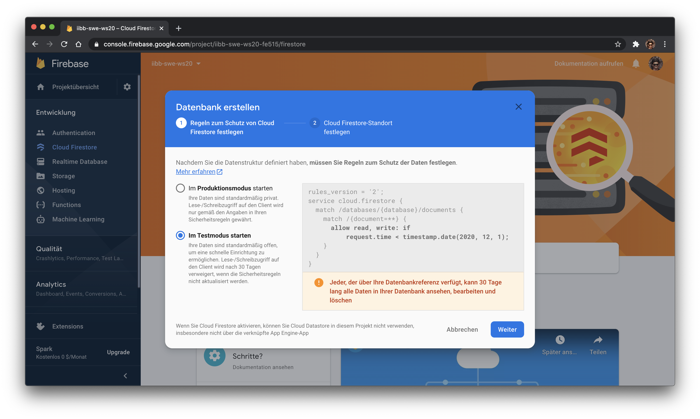
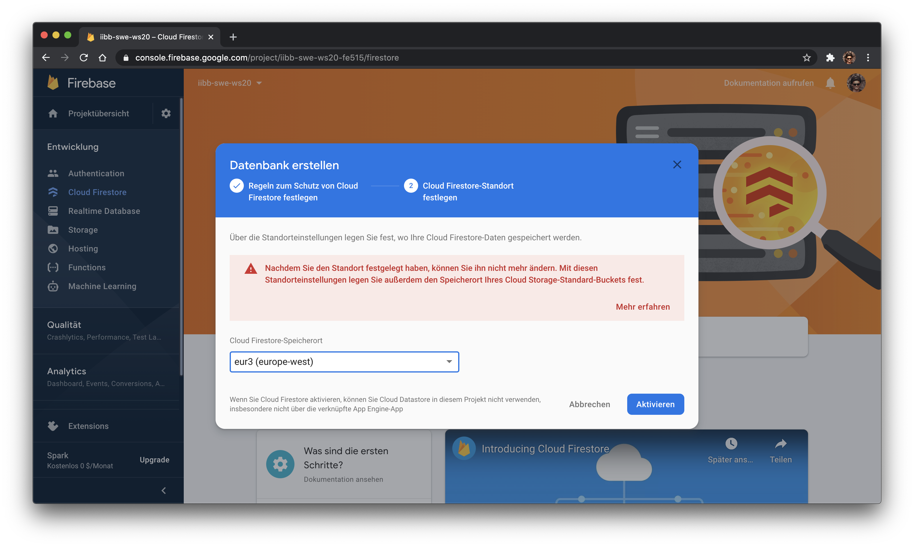

# Firebase - Firestore 

## Voraussetzungen

- [Visual Studio Code](https://code.visualstudio.com/)
- [REST Client](https://marketplace.visualstudio.com/items?itemName=humao.rest-client)

## CRUD Operationen im Firestore abbilden

- Create: `POST.rest`
- Read: `GET.rest`
- Update: `PATCH.rest`
- Delete: `DELETE.rest`

## Projekt anlegen

    
    
    
    
    
    
    
    

