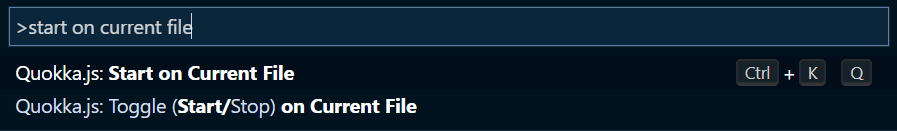
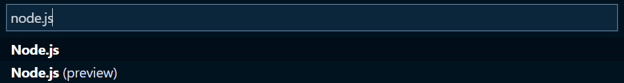

# Firebase - Firestore 

## Voraussetzungen

- [Visual Studio Code](https://code.visualstudio.com/)
- [nodejs](https://nodejs.org/en/)
- [Quokka.js](https://marketplace.visualstudio.com/items?itemName=WallabyJs.quokka-vscode)
- *optional* - [Live Share](https://marketplace.visualstudio.com/items?itemName=MS-vsliveshare.vsliveshare)

## Ausführung von JavaScript 

1. öffnen der Datei `index.js`
1. Quokka starten 
1. **optional** debuggen 

## Bei Fragen: [JavaScript-Referenz](https://developer.mozilla.org/de/docs/Web/JavaScript/Reference) Aufrufen

> eine Auwahl

- Standardobjekt: Array, (Async)Function, Boolean, Date, Error, Map, Number, Object, Set, String
- Ausrücke & Operatoren: Addition, Addition assignment, Assignment, Bedingter (ternärer) Operator, Destrukturierende Zuweisung, Funktionsausdruck, Objekt Initialisierer, Optionale Verkettung, Spread Syntax, await, 
- Anweisungen & Deklarationen: block, break, const, continue, debugger, export, for((await)...of), if...else, import, let, return, switch, trhow, try...catch
- Funktionen: Pfeilfunktionen, Default parameters, Methoden Definitionen, Rest Parameter